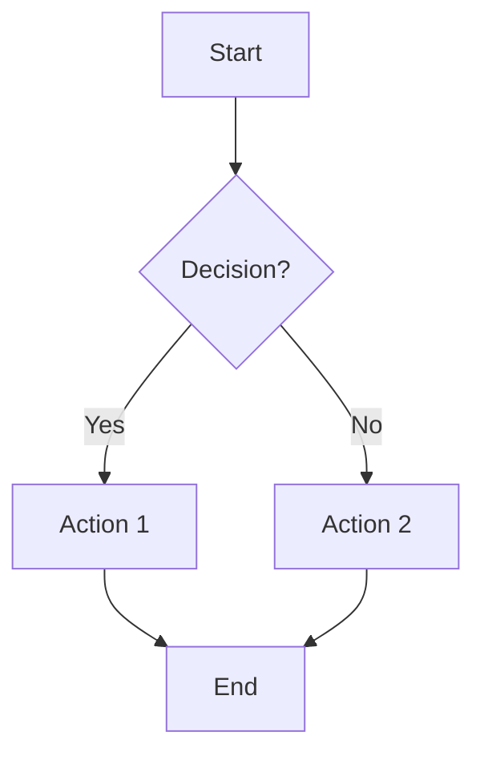
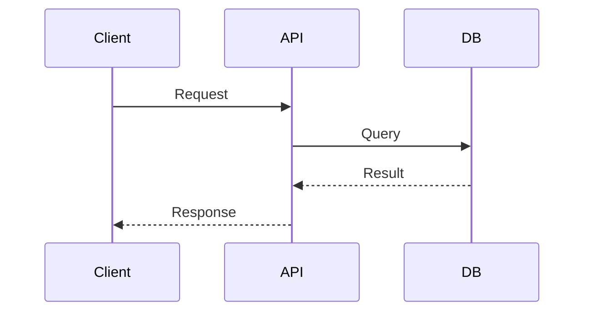
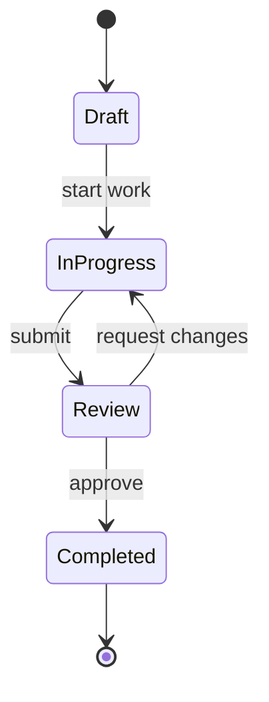
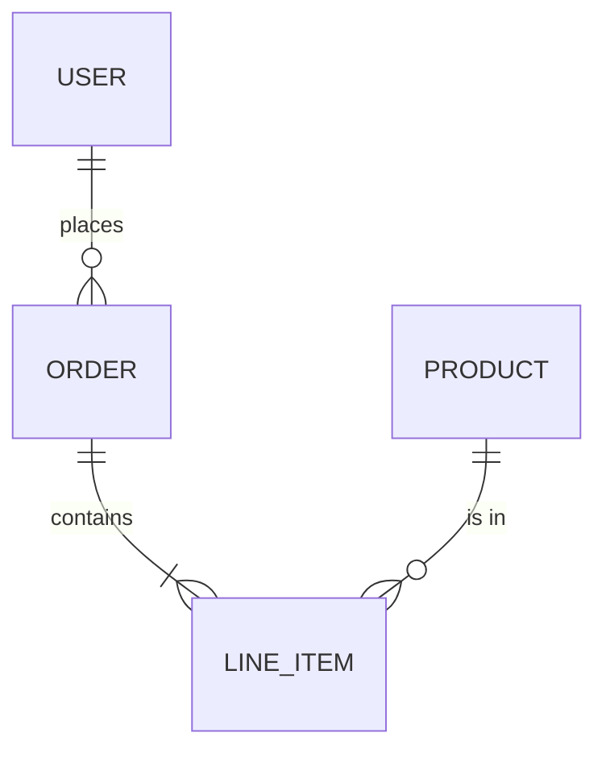
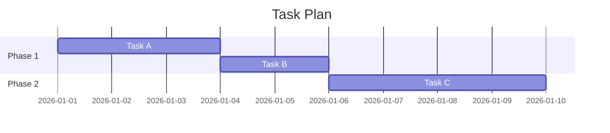
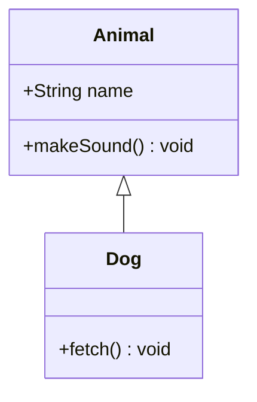

# Mermaid Diagrams Convention

## Rule

Whenever you need to create a diagram, chart, or visual representation in a markdown file, you MUST use **Mermaid syntax** inside fenced code blocks (` ```mermaid `). Do NOT use ASCII art, image links, or external diagramming tools.

## When to Use Diagrams

- **Architecture overviews** — system components and how they connect
- **Flow diagrams** — request flows, data pipelines, decision trees
- **Sequence diagrams** — interactions between services, APIs, or components
- **State diagrams** — lifecycle of an entity or process
- **Entity-relationship diagrams** — data models and their relationships
- **Gantt charts** — timelines and task scheduling in plans
- **Class diagrams** — object hierarchies and interfaces

## Integration with Plans

When creating or updating files in `.plans/`, include Mermaid diagrams to make plans clearer and more actionable:

- Add **flowcharts** to illustrate the approach in the "Decision / Approach" section
- Add **sequence diagrams** to describe interactions between components
- Add **Gantt charts** to show task dependencies and sequencing
- Add **ER diagrams** when the plan involves data model changes

### Extended Plan File Template

When a plan benefits from a visual, use this pattern:

```markdown
# <Title>

**Date:** YYYY-MM-DD
**Status:** draft | in-progress | completed | abandoned

## Context

Why are we doing this? What problem are we solving?

## Architecture / Design

` ` `mermaid
graph TD
    A[Component A] --> B[Component B]
    B --> C[Component C]
` ` `

## Decision / Approach

What did we decide? What approach are we taking?

## Tasks

- [ ] Task 1
- [ ] Task 2

## Notes

Any additional context.
```

## Mermaid Quick Reference

### Flowchart



### Sequence Diagram



### State Diagram



### Entity-Relationship Diagram



### Gantt Chart



### Class Diagram



## Behavior Rules

1. **Default to Mermaid** — whenever a visual would help explain something in markdown, use a Mermaid block.
2. **Keep diagrams focused** — show only what is relevant to the current discussion. Avoid cluttering diagrams with every possible detail.
3. **Label edges and nodes clearly** — use short, descriptive labels so the diagram is self-explanatory.
4. **Choose the right diagram type** — pick the Mermaid diagram type that best fits the information (flowchart for processes, sequence for interactions, ER for data models, etc.).
5. **Place diagrams near their context** — put the diagram right after the text that introduces it, not at the end of the document.
6. **Update diagrams when plans change** — if a plan's architecture or flow changes, update the corresponding Mermaid diagram to stay accurate.
